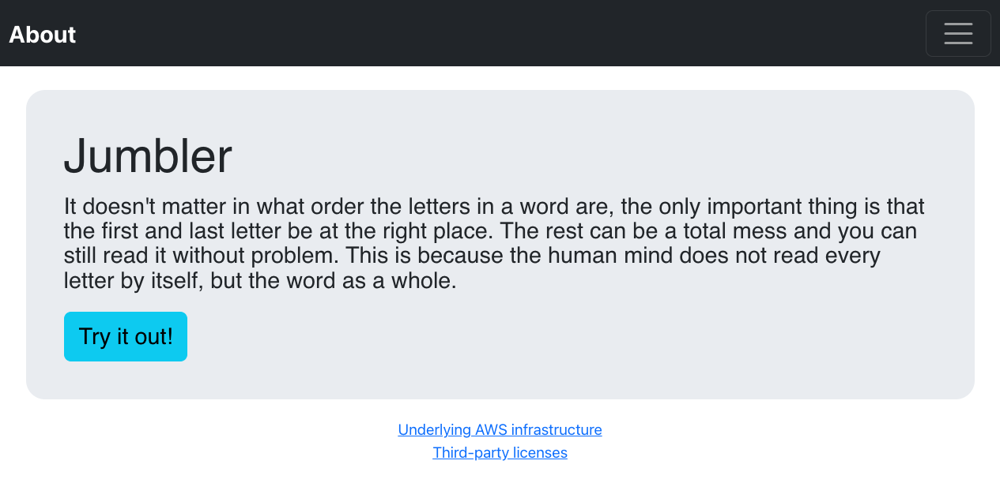

# React App Jumbler (JavaScript)

This implementation of the React App Jumbler is a small [React](https://reactjs.org) demo JavaScript application using the following features:

- Event handling
- Managing the state of the App class
- Excerpt of [React Bootstrap](https://react-bootstrap.github.io) components
- Dynamic imports of modules using
  - `import` as a function
  - `React.lazy()`

You are welcome to inspect the JS(X), HTML and CSS code as well as the JSON config files.

# Installation

Run the following commands for installation:

```
$ cd jumbler-react/jumbler-app-js
$ npm install
$ npm list --depth=0
jumbler-app-js@0.0.1 myPath/jumbler-app-js
├── @babel/core@7.12.10
├── @babel/plugin-proposal-class-properties@7.12.1
├── @babel/preset-env@7.12.11
├── @babel/preset-react@7.12.10
├── babel-loader@8.2.2
├── bootstrap@4.5.3
├── css-loader@5.0.1
├── fsevents@2.2.2
├── jquery@3.5.1
├── popper.js@1.16.1
├── react@16.14.0
├── react-bootstrap@1.4.0
├── react-dom@16.14.0
├── style-loader@2.0.0
├── webpack@4.44.2
├── webpack-cli@3.3.12
└── webpack-dev-server@3.11.1
```

Build the bundle using [webpack](https://webpack.js.org):

```
$ npm start
```

Start the webpack development server. Watch mode is configured via `webpack.config.json`:

```
$ npm run dev-server
```

Open React app in your browser: [http://localhost:8080/dist/index.html](http://localhost:8080/dist/index.html)

# Screenshot

You will see something like this.



# Background

## Hypothesis

It doesn't matter in what order the letters in a word are, the only important thing is that the first and last letter be at the right place. The rest can be a total mess and you can still read it without problem. This is because the human mind does not read every letter by itself, but the word as a whole.

## Example

The jumbling of the words of the hypothesis stated above might end up in the following result:

"It doesn't matetr in what order the letrets in a word are, the only imonarptt thing is that the first and last letetr be at the right place. The rest can be a total mess and you can still read it wihuott prbelom. This is beasuce the human mind does not read every letetr by itslef, but the word as a whole."

## Reference

This statement goes back to Graham Ernest Rawlinson: "The Significance of Letter Position in Word Recognition", PhD Thesis, 1976, University of Nottingham
