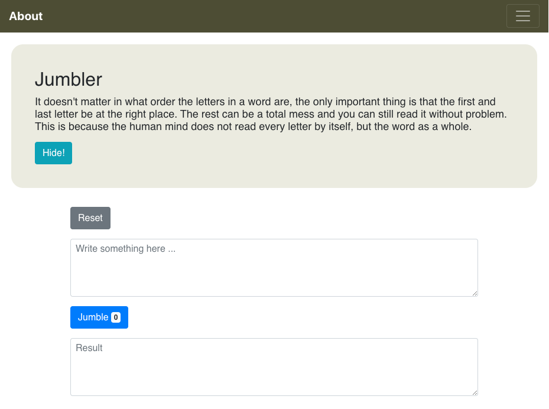

# React App Jumbler (TypeScript)

This implementation of the React App Jumbler is a small [React](https://reactjs.org) demo TypeScript application using the following features:

- Event handling
- Managing the state of the App class
- Excerpt of [React Bootstrap](https://react-bootstrap.github.io) components
- Dynamic imports of modules using
  - `import` as a function
  - `React.lazy()`

You are welcome to inspect the TS(X), HTML and CSS code as well as the JSON config files.

# Installation

Run the following commands for installation:

```
$ cd jumbler-react/jumbler-app-ts
$ npm install --save react@16.12.0 react-dom@16.12.0
$ npm install --save popper.js@1.16.0
$ npm install --save jquery@3.4.1
$ npm install --save bootstrap@4.3.1
$ npm install --save react-bootstrap@1.0.0-beta.16
$ npm install --save-dev webpack@4.41.6 webpack-cli@3.3.11 webpack-dev-server@3.9.0
$ npm install --save-dev @types/react@16.9.19 @types/react-dom@16.9.5
$ npm install --save-dev typescript@3.7.5
$ npm install --save-dev @babel/core@7.8.4 @babel/cli@7.8.4 @babel/plugin-proposal-class-properties@7.8.3 @babel/preset-env@7.8.4 @babel/preset-typescript@7.8.3 @babel/preset-react@7.8.3
$ npm install --save-dev babel-loader@8.0.6
$ npm install --save-dev style-loader@1.1.3 css-loader@3.4.2
$ npm list --depth=0
jumbler-app-ts@0.0.1 myPath/jumbler-app-ts
├── @babel/cli@7.8.4
├── @babel/core@7.8.4
├── @babel/plugin-proposal-class-properties@7.8.3
├── @babel/preset-env@7.8.4
├── @babel/preset-react@7.8.3
├── @babel/preset-typescript@7.8.3
├── @types/react@16.9.19
├── @types/react-dom@16.9.5
├── babel-loader@8.0.6
├── bootstrap@4.3.1
├── css-loader@3.4.2
├── jquery@3.4.1
├── popper.js@1.16.0
├── react@16.12.0
├── react-bootstrap@1.0.0-beta.16
├── react-dom@16.12.0
├── style-loader@1.1.3
├── typescript@3.7.5
├── webpack@4.41.6
├── webpack-cli@3.3.11
└── webpack-dev-server@3.9.0

```

Build the bundle using [webpack](https://webpack.js.org):

```
$ npm start
```

Start the webpack development server:

```
$ npm run dev-server
```

Open React app in your browser: [http://localhost:8080/dist/index.html](http://localhost:8080/dist/index.html)

# Screenshot

You will see something like this.



# Background

## Hypothesis

It doesn't matter in what order the letters in a word are, the only important thing is that the first and last letter be at the right place. The rest can be a total mess and you can still read it without problem. This is because the human mind does not read every letter by itself, but the word as a whole.

## Example

The jumbling of the words of the hypothesis stated above might end up in the following result:

"It doesn't matetr in what order the letrets in a word are, the only imonarptt thing is that the first and last letetr be at the right place. The rest can be a total mess and you can still read it wihuott prbelom. This is beasuce the human mind does not read every letetr by itslef, but the word as a whole."

## Reference

This statement goes back to Graham Ernest Rawlinson: "The Significance of Letter Position in Word Recognition", PhD Thesis, 1976, University of Nottingham
